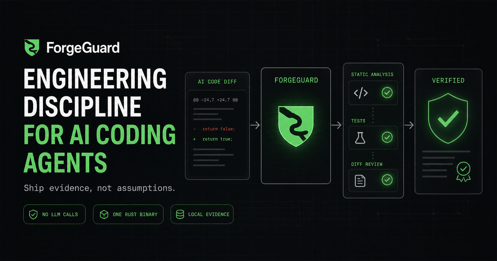

# ForgeGuard — engineering discipline for AI coding agents

<p align="center">
  <picture>
    <source media="(prefers-color-scheme: dark)" srcset="assets/brand/logo-dark.svg">
    
  </picture>
</p>

<p align="center">
  <strong>Token-efficient quality layer for AI coding agents.<br>Codex · Claude Code · Cursor · OpenCode · Antigravity — one Rust binary, no LLM calls.</strong>
</p>

<p align="center">
  
</p>

ForgeGuard is a language- and framework-agnostic quality layer for Codex, Claude Code, Cursor, OpenCode, Antigravity, and agents that support `AGENTS.md` or Agent Skills. It applies to backend services, web frontends, native and cross-platform mobile apps, AI systems, data code, automation scripts, CLIs, and infrastructure code.

Its goal is not merely code that runs. It makes agents work through:

```text
inspect → design → implement → test → review → verify
```

ForgeGuard pushes generated code toward the discipline expected from a top-tier software engineering team: correct boundaries, reusable behavior, efficient algorithms and queries, explicit failure handling, focused tests, reviewed diffs, and claims backed by executed evidence.

Workflow supervision and configured repository commands work with any language. Parser, structural-rule, and semantic-pack coverage are separate capabilities: Tree-sitter supplies syntax evidence across the listed profiles, while bounded import/binding and local-wrapper provenance is currently available for JavaScript/TypeScript, Python, Rust, and Go. Run `forgeguard capabilities` for the exact matrix. ForgeGuard is an AST-assisted quality scanner, not a whole-program semantic analyzer; findings remain review evidence, not a substitute for compilers, tests, profilers, or query plans.

## Why ForgeGuard

Model price and benchmark rank do not guarantee clean engineering. AI coding agents can produce working code while still introducing:

- duplicated business logic and components;
- repeated linear lookup or accidental `O(n²)` behavior;
- database queries inside loops and N+1 patterns;
- unbounded parallel requests;
- weak test coverage or unexecuted verification;
- abstractions at the wrong scope;
- unsupported claims that code is clean, optimal, or production-ready.

ForgeGuard corrects weak implementation assumptions before coding, teaches the relevant trade-off concisely, and verifies the result with deterministic local tooling.

## Token and usage contract

ForgeGuard is designed not to drain user context or model limits:

- The hook runs a local Rust binary and repository commands; ForgeGuard itself makes no LLM or external API call.
- Always-on policy stays compact; detailed backend, frontend, mobile, database, algorithm, testing, and AI references load only when relevant.
- Passing completion hooks add no model context in Codex/Claude; supported lifecycle hooks inject one compact material-ambiguity reminder, Claude refreshes it per user prompt, and OpenCode receives the same rule through the shared skill.
- Antigravity injects focus context only on the first model invocation of an execution.
- Blocking feedback is deduplicated and capped at 2,000 characters and five findings.
- Auto-poke is default-on and creates one host request per continuation; the generated limit is three and the hard cap is five.
- Full evidence stays local in `.forgeguard/reports/latest.json`.
- Unchanged worktrees use a local fingerprint cache instead of rerunning the gate.

A blocked gate may cause the host agent to use another turn to fix real failures. ForgeGuard spends model usage only indirectly when additional corrective work is necessary.

## MVP capabilities

- Rust single-binary CLI.
- Lightweight source detection across common backend, frontend, mobile, systems, data, script, and infrastructure languages.
- AST-backed loop and call-site analysis across the published parser capability matrix.
- Bounded database/network provenance packs for JavaScript/TypeScript, Python, Rust, and Go.
- Codex `AGENTS.md` plus project skills.
- Claude Code `CLAUDE.md` plus project skills.
- Cursor always-on rule plus shared project skills.
- OpenCode `AGENTS.md` plus shared project skills.
- Antigravity rule, shared project skill, and native `Stop` hook.
- Token-efficient `Stop` hooks: silent pass, bounded failure feedback, diff cache, and local full report.
- Cross-agent material-ambiguity guard: native context hooks for Claude, Codex, Cursor, and Antigravity; shared skill fallback for OpenCode.
- Session-scoped objective, todo, confidence, hill-climbability, auto-poke, resume, and scope-drift state.
- One `forgeguard-engineering` skill with conditional clean-code, algorithm, backend, frontend, mobile, database, AI, and testing references.
- Static rules for nested iteration, repeated linear lookup, sorting in loops, database I/O in loops, external requests in loops, unbounded fan-out, `SELECT *`, and potential duplicated blocks.
- Automatic formatter, linter, type-check, test, and build command discovery.
- `default`, `lite`, and `strict` operating modes with project and global persistence.
- Committed finding baselines for adopting strict gates without accepting new debt.
- Interactive mode selection during `forgeguard init` and via `forgeguard mode`.
- Human-readable, JSON, and SARIF 2.1.0 reports.

## Install

No Rust, Cargo, Node.js, or Python required. The installer downloads the correct GitHub Release artifact for the current OS and CPU, verifies its SHA-256 checksum, adds ForgeGuard to the user `PATH`, and installs global rules, skills, and supported hooks.

### Linux and macOS

```bash
curl -fsSL https://raw.githubusercontent.com/suiflex/ForgeGuard/main/install.sh | sh
```

### Windows PowerShell

```powershell
irm https://raw.githubusercontent.com/suiflex/ForgeGuard/main/install.ps1 | iex
```

Restart the terminal after installation. Then initialize any repository:

```bash
cd your-project
forgeguard init
forgeguard doctor
```

`forgeguard init` installs only for the agents that directory already uses. See
[Choosing agents](#choosing-agents) for how the selection is made.

Installers use GitHub Release binaries produced for Linux, macOS, and Windows on x86-64 and ARM64. Advanced users building unreleased source can still use:

```bash
cargo install --path crates/forgeguard-cli
```

### Homebrew

```bash
brew install suiflex/tap/forgeguard
```

A formula-installed binary is upgraded with `brew upgrade forgeguard`, not by re-running the installer. Global rules, skills, and hooks are not installed by the formula, so run `forgeguard init` afterwards.

### Scoop

```powershell
scoop bucket add suiflex https://github.com/suiflex/scoop-bucket
scoop install forgeguard
```

Upgrade with `scoop update forgeguard`.

### npm

The npm package installs the matching ForgeGuard GitHub Release binary for the current OS and CPU. It requires Node.js 18 or newer:

```bash
npm install -g @suiflex/forgeguard
forgeguard --version
```

To publish manually from a tagged release:

```bash
cd npm
npm pack --dry-run
npm publish --access public
```

The version in `npm/package.json` must match the GitHub Release tag, and release assets must already exist before publishing. The package postinstall script downloads and verifies the platform-specific archive checksum.

## Updating

`forgeguard update` only *checks* whether a newer release exists and prints a one-line
notice; it never installs anything. Upgrading is re-running the installer, then refreshing the
assets ForgeGuard already wrote.

### Upgrade the binary and global assets

Re-run the one-line installer. It downloads the latest release binary for the current OS and
CPU, verifies its SHA-256 checksum, and updates the user `PATH`.

```bash
curl -fsSL https://raw.githubusercontent.com/suiflex/ForgeGuard/main/install.sh | sh
```

```powershell
irm https://raw.githubusercontent.com/suiflex/ForgeGuard/main/install.ps1 | iex
```

The installer refreshes the binary but does not overwrite global rules or skills that already
exist. To re-apply the newer bundled global skills, policies, and hooks over an existing global
install, force it:

```bash
forgeguard init --global --agent all --force
```

Source builds upgrade with:

```bash
cargo install --path crates/forgeguard-cli
```

Check the installed version at any time:

```bash
forgeguard --version
```

Check whether a newer release exists (checks only; installs nothing):

```bash
forgeguard update
```

### Refresh an already-initialized project

New releases can ship updated policy files and engineering skills. A plain `forgeguard init`
never overwrites existing ForgeGuard files, so re-initialize with `--force` to pull the newer
bundle into a repository that was set up by an older version:

```bash
cd your-project
forgeguard init --force
forgeguard doctor
```

`--force` overwrites the ForgeGuard-owned policy and skill files and prunes obsolete
role-skill directories. For global installs it also relocates the Antigravity skill from
the superseded `~/.gemini/config/skills/` to `~/.gemini/antigravity-cli/skills/`, the path
[Antigravity CLI documents](https://antigravity.google/docs/cli/gcli-migration). ForgeGuard
no longer writes a user-level Antigravity hook file, because none is documented; the
workspace `.agents/hooks.json` gate is unchanged.

`.forgeguard/config.toml` is created once and then left alone. The operating mode and any
command you tuned survive every later `init`, `--refresh`, and `--force`; a committed
`.forgeguard/baseline.json` is likewise untouched.

### Keeping policy and skill files current

A new release can ship an updated engineering skill or policy template, but the copies in your
repository may also carry your own edits. `init` therefore compares them and reports the
difference instead of choosing for you:

```text
┌─ 2 ForgeGuard files differ from this version ──┐
│ CLAUDE.md                                      │
│ .claude/skills/forgeguard-engineering/SKILL.md │
└────────────────────────────────────────────────┘
◇ Replace them with the bundled versions? (y/N)
```

In a terminal it asks, listing every affected file and defaulting to **no**, so a stray Enter
never costs you your edits. Without a terminal it prints the same list and the command to run,
and changes nothing:

```bash
forgeguard init --refresh    # replace the drifted files, no prompt
forgeguard init --force      # replace every ForgeGuard-owned file, drifted or not
```

Neither flag touches `.forgeguard/config.toml`, and neither writes through a symlink: a
repository that points `AGENTS.md` at `CLAUDE.md` keeps both as they are, because replacing
the link would edit the file at the other end.

## Quick start

```bash
# Only needed after a source build; one-line installers already do this.
forgeguard init --global --agent all

cd your-project
forgeguard detect
forgeguard init
forgeguard doctor
forgeguard gate
```

If `forgeguard` is not found immediately after installation, restart the terminal so its updated user `PATH` is loaded. `forgeguard doctor` then explains missing project configuration, Git, hooks, or repository tools in plain command-level output.

Review only files changed in Git:

```bash
forgeguard review
```

Run all static rules but skip repository commands:

```bash
forgeguard gate --no-run
```

Produce machine-readable output:

```bash
forgeguard gate --json
forgeguard review --output sarif > forgeguard.sarif
```

Produce bounded agent-facing output:

```bash
forgeguard gate --changed --output compact
```

Record current static findings, then report only new findings:

```bash
forgeguard baseline create
git add .forgeguard/baseline.json
forgeguard gate
```

Replace a stale baseline after reviewing current findings:

```bash
forgeguard baseline create --force
```

## Generated project structure

Only the selected agents are written. A repository that uses Claude Code alone gets:

```text
your-project/
├── .forgeguard/config.toml
├── .forgeguard/baseline.json  # after `forgeguard baseline create`
├── .forgeguard/.gitignore
├── CLAUDE.md
├── .claude/settings.json
└── .claude/skills/forgeguard-engineering/
    ├── SKILL.md
    └── references/
```

Adding a target adds only its own files: `--agent codex` contributes `AGENTS.md`,
`.codex/hooks.json`, and `.agents/skills/`; `--agent cursor` contributes
`.cursor/rules/forgeguard.mdc`, `.cursor/hooks.json`, and `.agents/skills/`;
`--agent antigravity` contributes `.agents/rules/forgeguard.md` and `.agents/hooks.json`.

Existing policy and skill files are not overwritten unless `--force` is supplied. Hook installation merges one ForgeGuard entry into existing JSON and preserves unrelated settings. Global installation writes ForgeGuard-owned skills, compact policies, and hook entries for selected agents. `--force` also removes obsolete ForgeGuard-owned role-skill directories without touching unrelated skills.

When a project `.gitignore` already exists, `forgeguard init` appends the generated directories for
the selected agents (`.codex/`, `.claude/`, `.cursor/`, and/or `.agents/`). It preserves existing
patterns, avoids duplicate entries, and does not create a root `.gitignore`. The `AGENTS.md`-only
targets add no directory, so they add no ignore entry.

## Choosing agents

`forgeguard init` decides which integrations to write in one of three ways:

1. **Explicit `--agent`** always wins and is never second-guessed. It accepts a
   comma-separated list or a repeated flag, plus the `all` shortcut:

   ```bash
   forgeguard init --agent claude
   forgeguard init --agent claude,codex
   forgeguard init --agent all
   ```

2. **A terminal with no `--agent`** opens the interactive picker. It lists what each
   target writes, pre-checks the agents already configured in the directory, and
   treats an empty selection as "install nothing" rather than "install everything".

3. **No terminal and no `--agent`** — a script, CI job, or another agent shelling out —
   installs only for the agents whose own configuration is already present.

   | Agent | Detected by |
   |---|---|
   | Codex | `.codex/` |
   | Claude Code | `.claude/` |
   | Cursor | `.cursor/`, `.cursorrules` |
   | OpenCode | `.opencode/`, `opencode.json` |
   | Antigravity | `.agents/rules/`, `.agents/hooks.json`, `.agent/rules/` |
   | Windsurf / Devin | `.windsurf/`, `.devin/`, `.windsurfrules` |
   | GitHub Copilot | `.github/copilot-instructions.md`, `.github/instructions/` |
   | Cline | `.clinerules` |
   | Roo Code | `.roo/`, `.roorules` |

   Markers are the agent's own configuration. `.agents/skills/` is deliberately not
   one: Codex, Cursor, and OpenCode share that directory, so treating it as an
   Antigravity marker would make every re-run silently add a target. Under
   `--global` the equivalent user-directory paths are used instead.

   When nothing is detected, `init` writes nothing and exits **3** with the available
   choices on stderr, so a caller re-runs with an explicit selection instead of
   receiving every integration at once. With `--json`, it prints
   `{"needs_agent_selection": true, "choices": [...]}` instead. Exit code `2` still
   means a blocked gate.

Both report formats include the resolved `agents` list, so the output always states
what was installed.

## Agent support

| Agent | `--agent` | Rules | Skill | Automatic completion gate |
|---|---|---|---|---|
| Codex | `codex` | `AGENTS.md` | `.agents/skills` | `Stop` hook |
| Claude Code | `claude` | `CLAUDE.md` | `.claude/skills` | `Stop` hook |
| Cursor | `cursor` | `.cursor/rules` | `.agents/skills` | `stop` hook |
| Antigravity | `antigravity` | `.agents/rules` | `.agents/skills` | Native `Stop` hook |
| OpenCode | `opencode` | `AGENTS.md` | `.agents/skills` | Policy-enforced gate |
| Windsurf / Devin | `windsurf` | `AGENTS.md` | — | Policy-enforced gate |
| GitHub Copilot | `copilot` | `AGENTS.md` | — | Policy-enforced gate |
| Cline | `cline` | `AGENTS.md` | — | Policy-enforced gate |
| Roo Code | `roo` | `AGENTS.md` | — | Policy-enforced gate |

The last four read [`AGENTS.md`](https://agents.md/) natively, so ForgeGuard supports them
with that one file and writes nothing under `.windsurf/`, `.github/`, `.clinerules/`, or
`.roo/`. None of them exposes a hook API ForgeGuard can drive, and none has a documented
skill directory, so they receive the policy but not the engineering skill.

User-level rules are not shared the same way, so `--global` follows each agent's own
documented path instead: Cline reads `~/.agents/AGENTS.md`, Windsurf/Devin reads
`~/.codeium/windsurf/memories/global_rules.md`, and Roo reads `~/.roo/rules/`. Copilot
instructions are repository-scoped, so a global install writes nothing for it.

[OpenCode officially discovers](https://opencode.ai/docs/skills) both `AGENTS.md` and `.agents/skills`. Its current plugin lifecycle exposes `session.idle` only after the agent loop stops, so ForgeGuard does not claim a reliable blocking `Stop` hook there. The compact policy requires `forgeguard gate --changed --output compact` before completion. [Antigravity provides a native blocking `Stop` protocol](https://antigravity.google/docs/hooks), so failures automatically return the agent to its execution loop.

Other agents receive the universal CLI gate immediately. Agents that understand the emerging `AGENTS.md` and Agent Skills conventions also receive ForgeGuard guidance without a dedicated adapter.

## Configuration

Example:

```toml
version = 2
mode = "default"

[project]
name = "example-service"

[scan]
enabled = true
max_file_bytes = 1000000
include_tests = false
extra_excludes = ["generated/"]
duplicate_block_lines = 6

[policies]
warnings_block = false

[rules.FG-NET-001]
enabled = true
severity = "warning"
block = true

[focus]
enabled = true
max_retries = 3
no_progress_limit = 2
auto_poke = true
max_auto_pokes = 3
min_confidence = 80
min_hill_climbability = 80

[[commands]]
name = "lint"
command = "pnpm lint"
required = true
enabled = true

[[commands]]
name = "test"
command = "pnpm test"
required = true
enabled = true
timeout_seconds = 600
```

### Modes

ForgeGuard supports three operating modes:

- `default`: failed required commands block; static findings block only when a rule sets `block = true`.
- `lite`: report-only mode for baselining or cleanup work. Static findings do not block.
- `strict`: failed required commands plus Warning- and Error-level static findings block. Info remains evidence.

Version 1 configs preserve the old Strict behavior that blocks only Error findings. Run `forgeguard config migrate` to opt into version 2 policy; older `mode = "guard"` values still load as `strict`.

Per-rule `enabled`, `severity`, and `block` override global policy. `Lite` always keeps static findings nonblocking. Required command failures block in every mode.

Focus state and scope checks are local and make no LLM calls. `max_retries` bounds corrective turns; `no_progress_limit` stops a session that produces no repository or task-state progress. `auto_poke` is enabled automatically by `forgeguard init`; each continuation creates a new host request and consumes model tokens, so `max_auto_pokes` defaults to three and has a hard cap of five. Set `auto_poke = false` only when manually opting out. Pending todos, confidence below `min_confidence`, or goal-contract completeness below `min_hill_climbability` keep the task active. Hill-climbability is a deterministic 0–100 completeness score: metric, baseline, target, guardrail, and verification contribute 20 points each. ForgeGuard does not guess these fields from prose. `forgeguard task start --semantic` only asks a supported host to use its native goal evaluator.

See [Focus, auto-poke, and hill-climbability](docs/FOCUS.md) for the lifecycle, headless behavior, token bounds, upgrade path, and examples.

Example measurable task:

```bash
forgeguard task start --session "$SESSION" \
  --objective "Reduce /search latency without regressions" \
  --metric "p95 latency /search" --baseline "900 ms" --target "below 300 ms" \
  --guardrail "error rate does not increase" --verification "regression tests pass" \
  --todo "measure baseline" --todo "optimize endpoint"
forgeguard task todo --session "$SESSION" --done 1
forgeguard task ready --session "$SESSION" --confidence 90 --evidence "benchmark: p95 284 ms"
```

Set project mode:

```bash
forgeguard mode default
forgeguard mode lite
forgeguard mode strict
```

Set user-level/global mode:

```bash
forgeguard mode strict --global
```

Inspect mode as JSON:

```bash
forgeguard mode --json
forgeguard mode --global --json
```

When run in a terminal without an explicit mode, `forgeguard mode` opens the same interactive mode picker used by `forgeguard init`. Non-TTY calls and `--json` never prompt, so scripts and CI do not hang.

## Commands

| Command | Purpose |
|---|---|
| `forgeguard init` | Install project configuration and agent skills for the detected agents. Use `--agent` to select explicitly, `--global` for user-level skills, `--refresh` to replace drifted files. |
| `forgeguard detect` | Detect languages, frameworks, database tools, tests, and commands. |
| `forgeguard capabilities` | Show workflow, parser, structural-rule, and semantic-pack coverage. |
| `forgeguard doctor` | Verify configuration, Git, and required local tools. |
| `forgeguard mode` | Check or change project/global operating mode. |
| `forgeguard config migrate` | Upgrade config v1 to v2 without resetting commands or focus settings. |
| `forgeguard gate` | Run static rules and configured quality commands. |
| `forgeguard review` | Scan Git-changed files without running commands. |
| `forgeguard baseline create` | Record current static findings so gates report only new findings. |
| `forgeguard task start` | Register objective, goal metrics, todos, and optional scope prefixes. |
| `forgeguard task todo` | Add todos or mark 1-based todo indexes complete. |
| `forgeguard task ready` | Submit exact evidence and optional model confidence before the completion gate. |
| `forgeguard task status` | Inspect session-scoped objective state. |
| `forgeguard hook stop/context/scope` | Internal lifecycle adapters for completion, objective restoration, and scope warnings. |

## Agent contract

```text
Developer
  ↓
Claude Code / Codex / Cursor / OpenCode / Antigravity
  ↓
ForgeGuard compact rules + conditional skill + Stop hook
  ↓
session objective + goal metric + todo state + confidence history + executed evidence
  ↓
Repository tools
  ↓
Code changes
  ↓
ForgeGuard changed-file quality gate
```

Agents must follow `inspect → design → implement → test → review → verify`. Detailed algorithm guidance loads only for relevant data paths. Full 13-point performance evidence is reserved for performance-critical work or explicit requests.

## Rule philosophy

ForgeGuard separates rules into:

1. **Deterministic/semantic:** failed commands and provenance-confirmed database/network calls can block.
2. **Structural/heuristic:** possible nested scans, receiver-name matches, and duplicate code provide review evidence with explicit confidence.
3. **Evidence-based:** performance and quality improvements require benchmarks, query plans, profiler output, or evaluation reports.

See [Rule catalog](docs/RULES.md) and [Architecture](docs/ARCHITECTURE.md).

## Development

```bash
cargo fmt --all -- --check
cargo clippy --workspace --all-targets --all-features -- -D warnings
cargo test --workspace
cargo build --workspace
cargo deny check
cargo audit --deny warnings
```

Maintainers publish binaries by pushing a tag matching the workspace version, for example `v0.2.0`. The release workflow verifies the tag, tests the repository and installers, builds six native platform archives, generates checksums, and publishes the GitHub Release automatically.

## Security

ForgeGuard executes commands declared in a repository's `.forgeguard/config.toml`. Review configuration and agent hooks before trusting an untrusted repository. CI runs `cargo-deny` and `cargo-audit`; GitHub Actions are commit-SHA pinned and updated through Dependabot. See [SECURITY.md](SECURITY.md).

## License

MIT
